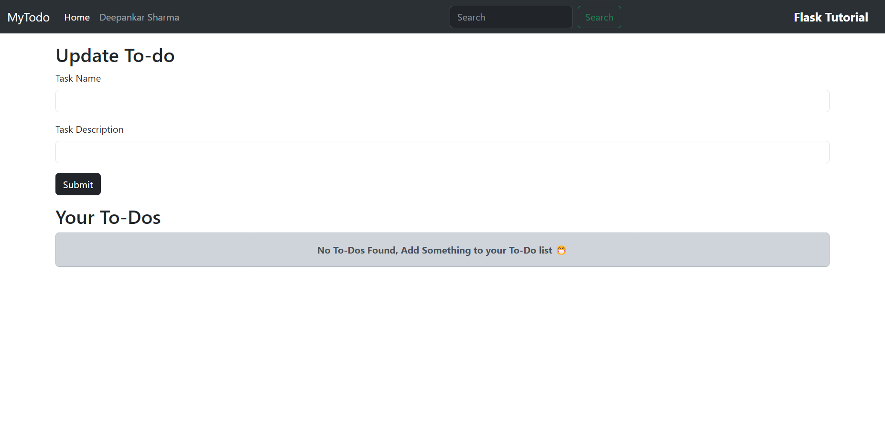
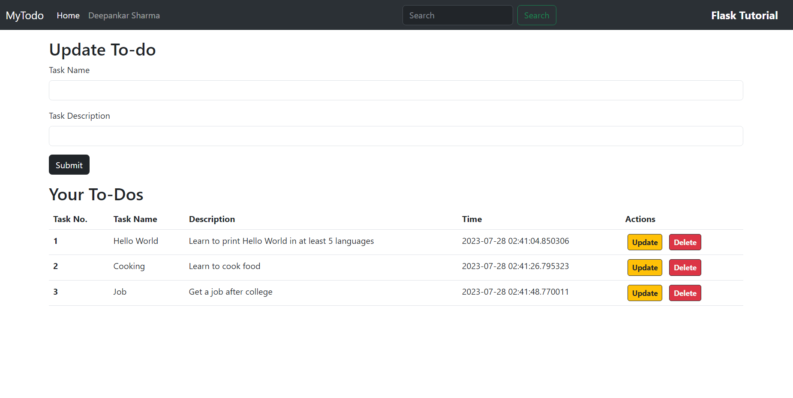
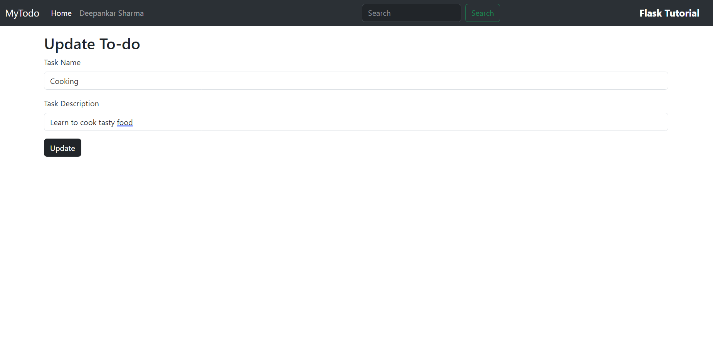

# **MyTodo-A simple Flask App**

This Flask project implements a simple todo list application. Users can add, view, update, and delete tasks using a web interface. The tasks are stored in a SQLite database for persistence. The app allows users to submit task titles and descriptions, which are then displayed on the main page. Tasks can be updated or removed as needed. The user interface is straightforward and user-friendly. The project showcases the use of Flask for building web applications with basic CRUD (Create, Read, Update, Delete) functionalities.

`Working Snapshots`

